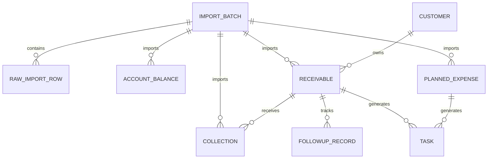

# CEO 现金流驾驶舱 V3 数据库表结构与字段字典

文档版本：V0.1  
适用阶段：阶段 3——真实样本验证  
目标读者：产品经理、CFO/财务、前端、后端  
文档状态：技术基线，业务口径待 CFO 确认

## 1. 目的与边界

本文定义驾驶舱计算必须具备的标准数据模型。它不是对财务现有 Excel 的复制，也不是最终 ERP 数据模型。

真实报表通过导入映射转换为本模型：

```text
财务原始报表 → 原始行留存 → 字段映射与校验 → 标准业务表 → 指标/风险/任务计算 → 驾驶舱
```

V3 只覆盖账户余额、应收款、实际回款、计划支出、责任人和跟进闭环。预算、合同、付款审批、银行接口和完整权限不在本版冻结范围内。

## 2. 建模原则

1. 业务表只保存原始事实；逾期天数、未回金额、风险等级、现金流缺口由系统计算。
2. 每条标准业务数据保留 `import_batch_id`，能够追溯到导入批次和原始行。
3. 金额统一按“元”保存，数据库使用 `numeric(18,2)`，禁止浮点数。
4. 日期使用 `date`，操作时间使用带时区的 `timestamptz`。
5. 已发布数据不物理删除，通过作废或更正保留历史。
6. V3 按“整批发布”处理；同一时点仅一个批次作为驾驶舱当前数据版本。
7. 财务报表格式变化由导入适配层处理，不能直接推动核心业务表频繁变化。

## 3. 实体关系



## 4. 通用字段约定

除特别说明外，业务表包含：

| 字段 | 类型 | 必填 | 说明 |
| --- | --- | --- | --- |
| id | uuid | 是 | 系统主键 |
| import_batch_id | uuid | 是 | 来源导入批次 |
| source_row_no | integer | 否 | 原 Excel 行号，用于追溯 |
| status | varchar(20) | 是 | active / voided |
| created_at | timestamptz | 是 | 创建时间 |
| updated_at | timestamptz | 是 | 更新时间 |
| version | integer | 是 | 乐观锁版本，初始为 1 |

## 5. 表结构与字段字典

### 5.1 import_batch——导入批次

| 字段 | 类型 | 必填 | 约束/示例 | 说明 |
| --- | --- | --- | --- | --- |
| id | uuid | 是 | PK | 批次主键 |
| batch_no | varchar(40) | 是 | UNIQUE | 业务可读批次号 |
| file_name | varchar(255) | 是 |  | 原文件名 |
| file_sha256 | char(64) | 是 | INDEX | 文件摘要，用于识别重复文件 |
| template_version | varchar(20) | 是 | `V0.1` | 模板版本 |
| data_period_start | date | 是 |  | 样本数据开始日期 |
| data_period_end | date | 是 | >= start | 样本数据结束日期 |
| status | varchar(24) | 是 | uploaded/parsing/validation_failed/pending_review/published/voided | 批次状态 |
| total_rows | integer | 是 | >= 0 | 总行数 |
| valid_rows | integer | 是 | >= 0 | 校验通过行数 |
| error_rows | integer | 是 | >= 0 | 错误行数 |
| warning_rows | integer | 是 | >= 0 | 警告行数 |
| uploaded_by | varchar(100) | 是 |  | V3 可存账号或操作者名称 |
| published_by | varchar(100) | 否 |  | 发布人 |
| published_at | timestamptz | 否 |  | 发布时间 |
| created_at | timestamptz | 是 |  | 创建时间 |
| updated_at | timestamptz | 是 |  | 更新时间 |
| version | integer | 是 | default 1 | 乐观锁 |

关键规则：同一文件摘要重复上传返回冲突；发布时必须无阻断错误；发布动作需要幂等。

### 5.2 raw_import_row——原始导入行

| 字段 | 类型 | 必填 | 说明 |
| --- | --- | --- | --- |
| id | uuid | 是 | 主键 |
| import_batch_id | uuid | 是 | 导入批次 |
| sheet_name | varchar(100) | 是 | 原 Sheet 名称 |
| row_no | integer | 是 | 原始行号 |
| raw_data | jsonb | 是 | 原始表头和值，不做业务解释 |
| normalized_data | jsonb | 否 | 映射后的标准字段预览 |
| validation_status | varchar(16) | 是 | valid/warning/error |
| validation_messages | jsonb | 是 | 字段级错误数组 |
| created_at | timestamptz | 是 | 创建时间 |

唯一约束：`(import_batch_id, sheet_name, row_no)`。

### 5.3 account_balance——账户余额快照

| 字段 | 类型 | 必填 | Excel 字段 | 业务定义/校验 |
| --- | --- | --- | --- | --- |
| account_code | varchar(64) | 是 | 账户编号 | 账户稳定标识，不使用银行账号明文 |
| account_name | varchar(120) | 是 | 账户名称 | 脱敏展示名称 |
| snapshot_date | date | 是 | 快照日期 | 余额对应日期 |
| available_balance | numeric(18,2) | 是 | 可用余额（元） | 可为 0，不得小于 0；负数场景待 CFO 确认 |
| currency | char(3) | 是 | 币种 | V3 默认 CNY |
| restricted_amount | numeric(18,2) | 否 | 受限金额（元） | 默认 0；是否从可用余额扣除待确认 |
| remark | varchar(500) | 否 | 备注 |  |

唯一约束：`(account_code, snapshot_date, import_batch_id)`。

### 5.4 customer——客户

| 字段 | 类型 | 必填 | Excel 来源 | 说明 |
| --- | --- | --- | --- | --- |
| id | uuid | 是 | 系统生成 | 主键 |
| customer_code | varchar(64) | 是 | 应收款.客户编号 | 稳定唯一标识 |
| customer_name | varchar(200) | 是 | 应收款.客户名称 | V3 使用脱敏名称 |
| customer_level | varchar(20) | 否 | 客户等级 | normal/key；是否参与风险待确认 |
| active | boolean | 是 |  | 默认 true |
| created_at | timestamptz | 是 |  | 创建时间 |
| updated_at | timestamptz | 是 |  | 更新时间 |

V3 可由应收导入时按 `customer_code` 自动建立或更新，不要求单独客户模板。

### 5.5 receivable——应收事项

| 字段 | 类型 | 必填 | Excel 字段 | 业务定义/校验 |
| --- | --- | --- | --- | --- |
| receivable_no | varchar(64) | 是 | 应收编号 | 全局稳定编号 |
| customer_id | uuid | 是 | 客户编号映射 | 关联客户 |
| business_ref_no | varchar(64) | 否 | 合同/业务编号 | 用于外部追溯，不作为 V3 必填 |
| receivable_amount | numeric(18,2) | 是 | 应收金额（元） | 本应收事项原始应收额，必须 > 0 |
| agreed_due_date | date | 是 | 约定到账日期 | 逾期判断基准 |
| expected_date | date | 否 | 预计到账日期 | 若为空，V3 暂以约定到账日作为预计日，待 CFO 确认 |
| owner_code | varchar(64) | 是 | 责任人编号 | 稳定标识 |
| owner_name | varchar(100) | 是 | 责任人名称 | 展示名称 |
| business_line | varchar(100) | 否 | 业务线 | 后续分析维度 |
| source_status | varchar(20) | 是 | 业务状态 | open/cancelled；不得导入“已逾期”等计算状态 |
| remark | varchar(500) | 否 | 备注 |  |

唯一约束：`(receivable_no, import_batch_id)`；发布版本内 `receivable_no` 唯一。

### 5.6 collection——实际回款

| 字段 | 类型 | 必填 | Excel 字段 | 业务定义/校验 |
| --- | --- | --- | --- | --- |
| collection_no | varchar(64) | 是 | 回款编号 | 唯一到账事件编号 |
| receivable_id | uuid | 是 | 应收编号映射 | V3 一笔回款只对应一笔应收 |
| collection_date | date | 是 | 回款日期 | 实际到账日期 |
| collection_amount | numeric(18,2) | 是 | 回款金额（元） | 必须 > 0 |
| currency | char(3) | 是 | 币种 | 默认 CNY |
| bank_reference | varchar(100) | 否 | 银行流水参考号 | 脱敏，不保存敏感账号 |
| remark | varchar(500) | 否 | 备注 |  |

唯一约束：`collection_no`。关联校验：累计有效回款超过应收金额时阻止发布，除非 CFO 明确允许溢收。

### 5.7 planned_expense——计划支出

| 字段 | 类型 | 必填 | Excel 字段 | 业务定义/校验 |
| --- | --- | --- | --- | --- |
| expense_no | varchar(64) | 是 | 支出计划编号 | 稳定唯一编号 |
| expense_name | varchar(200) | 是 | 支出名称 | 经营可读名称 |
| category | varchar(100) | 是 | 支出类别 | V3 分类枚举待财务确认 |
| planned_date | date | 是 | 计划支出日期 | 参与当月计划支出统计 |
| planned_amount | numeric(18,2) | 是 | 计划金额（元） | 必须 > 0 |
| owner_code | varchar(64) | 是 | 责任人编号 |  |
| owner_name | varchar(100) | 是 | 责任人名称 |  |
| rigidity | varchar(16) | 是 | 刚性程度 | rigid/deferrable，待 CFO 确认 |
| approval_status | varchar(20) | 是 | 审批状态 | planned/pending/approved/cancelled |
| remark | varchar(500) | 否 | 备注 |  |

唯一约束：`(expense_no, import_batch_id)`；`cancelled` 不参与计划支出。

### 5.8 followup_record——回款跟进记录

| 字段 | 类型 | 必填 | 说明 |
| --- | --- | --- | --- |
| id | uuid | 是 | 主键 |
| receivable_id | uuid | 是 | 应收事项 |
| followed_at | timestamptz | 是 | 跟进时间 |
| followed_by_code | varchar(64) | 是 | 跟进人编号 |
| followed_by_name | varchar(100) | 是 | 跟进人名称 |
| content | varchar(1000) | 是 | 跟进结果 |
| next_followup_date | date | 否 | 下次跟进日期 |
| promised_collection_date | date | 否 | 客户承诺到账日期，是否替代 expected_date 待确认 |
| created_at | timestamptz | 是 | 创建时间 |

### 5.9 task——待处理任务

任务是规则产物，不由 Excel 直接导入。

| 字段 | 类型 | 必填 | 说明 |
| --- | --- | --- | --- |
| id | uuid | 是 | 主键 |
| task_type | varchar(32) | 是 | cash_gap/collection_overdue/expense_review/owner_missing |
| source_type | varchar(32) | 是 | receivable/planned_expense/batch/system |
| source_id | uuid | 否 | 来源对象 |
| title | varchar(200) | 是 | 任务标题 |
| risk_level | varchar(16) | 是 | green/yellow/red |
| owner_code | varchar(64) | 否 | 责任人编号 |
| owner_name | varchar(100) | 否 | 责任人名称 |
| due_date | date | 是 | 处理截止日 |
| status | varchar(20) | 是 | pending/in_progress/completed/closed |
| boss_intervention_required | boolean | 是 | 是否需要老板介入 |
| rule_version | varchar(20) | 是 | 生成任务的规则版本 |
| created_at | timestamptz | 是 | 创建时间 |
| updated_at | timestamptz | 是 | 更新时间 |
| version | integer | 是 | 乐观锁 |

建议唯一约束：同一 `source_type + source_id + task_type + due_date` 不重复生成未关闭任务。

## 6. 索引建议

- `import_batch(status, created_at desc)`
- `raw_import_row(import_batch_id, validation_status)`
- `account_balance(snapshot_date desc, account_code)`
- `receivable(agreed_due_date, source_status)`
- `receivable(customer_id, owner_code)`
- `collection(receivable_id, collection_date)`
- `planned_expense(planned_date, approval_status)`
- `task(status, due_date, risk_level)`
- `followup_record(receivable_id, followed_at desc)`

## 7. V3 暂缓冻结项

- 一笔回款分摊到多笔应收：真实样本若存在，增加 `collection_allocation` 关联表。
- 多币种折算：V3 仅支持 CNY；汇率和折算日期后续设计。
- 预算与支出审批：待 CFO 提供预算维度及审批数据后扩展。
- 客户主数据独立维护：V3 可从应收数据派生。
- 组织、账号和 RBAC：阶段 4 处理。

## 8. CFO/产品待确认

1. 应收金额是当期应收还是合同总额。
2. 预计回款按约定到账日还是最新承诺日期统计。
3. 部分回款后的逾期口径。
4. 超额回款、退款、冲销如何表达。
5. 计划支出包含哪些审批状态和固定支出。
6. 账户可用余额是否已扣除受限资金。
7. 风险阈值、金额阈值及老板介入条件。
8. 一笔回款是否可能对应多笔应收。
9. 各数据类型采用全量覆盖还是增量更新。

