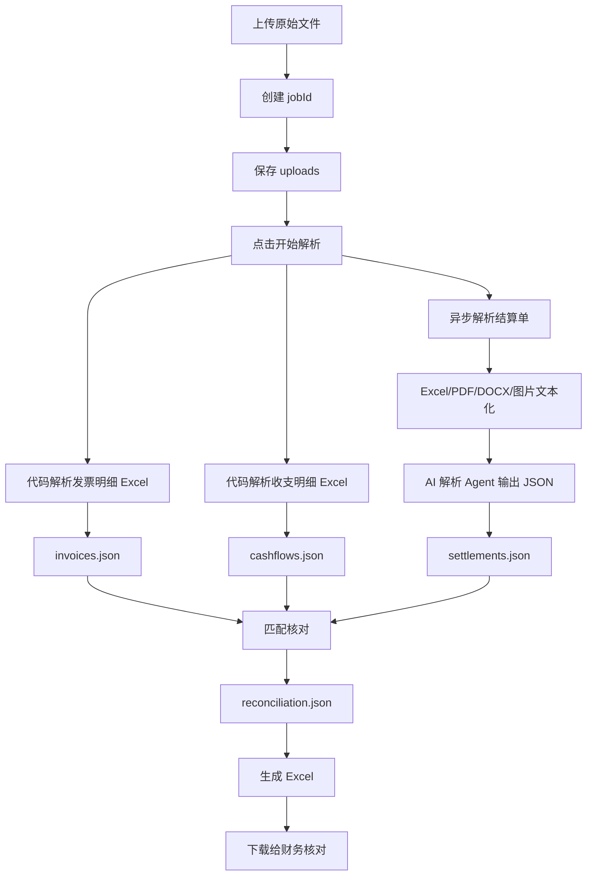

# 技术服务收入核对模块 Demo 版技术方案

## 1. 背景与目标

当前要验证的是 2026 年 4-5 月技术服务收入的“收入链路核对”流程。第一版不直接改 CEO 首页，也不直接把原始 Excel/PDF 接进驾驶舱正式指标，而是先在后台增加一个验证页面：

1. 上传 3 类原始材料。
2. 解析成结构化 JSON。
3. 按已确认的财务口径做匹配。
4. 生成一份可给财务核对的 Excel。

Demo 的核心产物是一份 `4-5月技术服务收入链路核对表.xlsx`，里面包含正常收入、异常收入、异常原因和简单统计。财务只需要看异常项和系统统计是否符合预期。

## 2. 已确认财务口径

| 材料 | 定位 | 系统用途 |
| --- | --- | --- |
| 结算单 | 计算依据 | 说明这笔收入怎么计算出来，不直接作为最终确认收入 |
| 发票/开票明细 | 收入确认依据 | CEO 驾驶舱里的“财务确认收入”优先按发票金额 |
| 到账记录/服务收支明细 | 现金依据 | 判断这笔收入有没有实际回款、什么时候回款、是否影响现金流 |

口径规则：

1. 收入归属月份 = 开票月份。
2. 确认收入金额 = 结算单金额 / 发票金额。
3. 到账金额 = 回款记录金额，是现金结果，不作为收入确认依据。
4. 未到账金额 = 确认收入金额 - 已到账金额。
5. 结算单、发票、到账金额不一致时，标记为“金额异常，待财务确认”。
6. 红冲、作废、非正数发票不计入确认收入。

## 3. Demo 边界

本阶段要做：

1. 后台新增“收入核对”页面。
2. 支持上传开票明细 Excel、服务收支明细 Excel、结算单文件。
3. 支持结算单 Excel/PDF/DOCX 的解析入口。
4. 支持对结算单提取出来的文字/表格文本调用 AI 解析 Agent，输出标准 JSON。
5. 输出 3 份中间 JSON：`invoices.json`、`cashflows.json`、`settlements.json`。
6. 基于 JSON 做匹配，输出 `reconciliation.json`。
7. 生成可下载 Excel。
8. 页面展示文件解析成功/失败状态、失败原因、最终统计和下载按钮。

本阶段先不做：

1. 不直接接 CEO 首页正式卡片。
2. 不做财务在线编辑和确认流程。
3. 不做正式收入台账入库。
4. 不做复杂模糊匹配和自动财务结论。
5. 不要求所有扫描 PDF 都 100% 解析成功；解析失败要明确记录原因，留给人工确认。

## 4. 输入文件类型

### 4.1 开票明细

当前样本文件：

`test-data/测试数据26.4-5月开票明细.xlsx`

主要使用工作表：

`发票基础信息`

关键字段：

| Excel 字段 | 系统字段 | 说明 |
| --- | --- | --- |
| 数电发票号码 | invoiceNo | 发票号 |
| 购买方名称 | customerName | 客户名称 |
| 开票日期 | invoiceDate | 开票日期 |
| 价税合计 | invoiceAmount | 发票金额，第一版用于确认收入和匹配 |
| 发票状态 | invoiceStatus | 判断是否正常、红冲、作废 |
| 是否正数发票 | isPositiveInvoice | 判断是否正数发票 |
| 备注 | remark | 红冲说明、关联说明，先保留用于追溯 |

有效发票规则：

1. `发票状态 = 正常`。
2. `是否正数发票 = 是`。
3. `发票状态` 包含 `红冲`、`作废`，或者 `是否正数发票 = 否`，均不计入确认收入。

### 4.2 服务收支明细

当前样本文件：

`test-data/测试数据2026年4月-5月服务收支明细.xlsx`

关键字段：

| Excel 字段 | 系统字段 | 说明 |
| --- | --- | --- |
| 日期 | transactionDate | 到账日期 |
| 摘要 | summary | 收款摘要 |
| 收支类别 | category | 收入类别 |
| 往来单位 | customerName | 客户名称 |
| 收入(借方) | receivedAmount | 到账金额 |
| 支出(贷方) | expenseAmount | 支出金额，收入核对第一版不使用 |
| 账户 | accountName | 收款账户 |

第一版只取 `收入(借方) > 0` 的服务收入记录作为到账候选。

### 4.3 结算单

当前样本里结算单可能是 Excel、PDF、DOCX：

1. Excel 结算单：先转成 sheet 文本或 markdown 表格，再交给 AI 解析 Agent 抽取字段。
2. 文本型 PDF：优先用 PDF 文本提取。
3. 扫描/图片型 PDF：先把 PDF 页面渲染成图片，再用 OCR 提取文字；识别失败才标记为 `needs_ocr`。
4. DOCX：优先用文档解析提取文本，再由 AI 解析 Agent 抽取字段。
5. 图片结算单：直接用 OCR 提取文字，再交给 AI 解析 Agent 抽取字段。

结算单需要抽取的最小字段：

| 字段 | 说明 |
| --- | --- |
| customerName | 客户名称/付款方名称 |
| settlementPeriod | 结算周期 |
| settlementAmount | 技术服务费金额/结算金额 |
| sourceFile | 来源文件 |
| parseStatus | 解析状态 |
| parseReason | 失败或警告原因 |

## 5. 页面交互流程

后台左侧菜单增加：

`收入核对`

页面流程：

1. 用户上传文件。
2. 系统保存文件，创建核对任务。
3. 用户点击“开始解析”。
4. 后端异步解析文件。
5. 页面轮询任务状态。
6. 解析完成后展示文件解析列表。
7. 用户点击“生成核对 Excel”。
8. 后端执行匹配和 Excel 导出。
9. 页面展示老板卡片统计，并提供“下载核对表”。

按钮状态：

| 任务状态 | 主按钮 | 说明 |
| --- | --- | --- |
| uploaded | 开始解析 | 文件已上传，等待解析 |
| parsing | 解析中 | 按钮 loading，不可重复点击 |
| parsed | 生成核对 Excel | 解析完成，可进入匹配导出 |
| parse_failed | 重新解析 | 有文件解析失败，可重试 |
| generating | 生成中 | 按钮 loading |
| generated | 下载核对表 | Excel 已生成 |
| generate_failed | 重新生成 | 匹配或导出失败 |

解析预览第一版不做复杂明细编辑，只展示：

1. 文件名。
2. 文件类型。
3. 解析状态。
4. 解析行数。
5. 有效行数。
6. 失败或警告原因。

## 6. 后端处理流程



## 7. 文件存储结构

Demo 阶段先用文件目录保存任务状态和中间结果，不强制建业务表。

```text
storage/income-reconciliation/jobs/{jobId}/
  uploads/
    invoice.xlsx
    cashflow.xlsx
    settlements/
      xxx.pdf
      xxx.docx
      xxx.xlsx
  parsed/
    files.json
    invoices.json
    cashflows.json
    settlements.json
  result/
    reconciliation.json
    reconciliation.xlsx
```

如果后续要产品化，再迁移到数据库表：

1. `income_reconciliation_jobs`
2. `income_reconciliation_files`
3. `income_reconciliation_invoice_rows`
4. `income_reconciliation_cashflow_rows`
5. `income_reconciliation_settlement_rows`
6. `income_reconciliation_results`

Demo 阶段不建议一开始建全量业务表，避免字段还没稳定就被表结构锁死。

## 8. JSON 数据结构

### 8.1 files.json

用于页面展示文件解析列表。

```json
[
  {
    "fileId": "file_001",
    "fileName": "测试数据26.4-5月开票明细.xlsx",
    "fileType": "invoice_excel",
    "parseStatus": "success",
    "parsedRows": 76,
    "validRows": 60,
    "errorReason": null
  }
]
```

### 8.2 invoices.json

发票 JSON 是由开票明细 Excel 解析出来的。

```json
[
  {
    "sourceFile": "测试数据26.4-5月开票明细.xlsx",
    "sourceSheet": "发票基础信息",
    "invoiceNo": "24192000000000000000",
    "customerName": "正邦科技有限公司",
    "invoiceDate": "2026-05-15",
    "invoiceMonth": "2026-05",
    "invoiceAmount": 12625.64,
    "isEffective": true,
    "invalidReason": null,
    "rawRow": {}
  }
]
```

无效发票示例：

```json
{
  "invoiceNo": "24192000000000000001",
  "customerName": "某客户有限公司",
  "invoiceDate": "2026-05-20",
  "invoiceMonth": "2026-05",
  "invoiceAmount": -10000,
  "isEffective": false,
  "invalidReason": "红字发票，不计入确认收入",
  "rawRow": {}
}
```

### 8.3 cashflows.json

```json
[
  {
    "sourceFile": "测试数据2026年4月-5月服务收支明细.xlsx",
    "customerName": "正邦科技有限公司",
    "transactionDate": "2026-05-15",
    "receivedAmount": 12625.64,
    "summary": "收正邦科技服务费",
    "rawRow": {}
  }
]
```

### 8.4 settlements.json

```json
[
  {
    "sourceFile": "5.15-正邦测试数据-10614.54.xlsx",
    "sourceType": "excel",
    "customerName": "正邦科技有限公司",
    "settlementPeriod": "2026-04",
    "settlementAmount": 12625.64,
    "parseStatus": "success",
    "parseReason": null,
    "rawText": ""
  }
]
```

扫描 PDF/OCR 暂无法识别时：

```json
{
  "sourceFile": "紫金陈小说公司5月结算单（5.13）.pdf",
  "sourceType": "pdf",
  "customerName": null,
  "settlementPeriod": null,
  "settlementAmount": null,
  "parseStatus": "needs_ocr",
  "parseReason": "PDF 经 OCR 后未提取到有效文本，需要人工确认",
  "rawText": ""
}
```

### 8.5 reconciliation.json

```json
{
  "summary": {
    "confirmedRevenue": 12625.64,
    "receivedAmount": 12625.64,
    "unreceivedAmount": 0,
    "normalCount": 1,
    "abnormalCount": 0,
    "invalidInvoiceCount": 0,
    "manualCheckRequiredCount": 0
  },
  "items": [
    {
      "customerName": "正邦科技有限公司",
      "invoiceNo": "24192000000000000000",
      "invoiceDate": "2026-05-15",
      "revenueMonth": "2026-05",
      "invoiceAmount": 12625.64,
      "settlementFile": "5.15-正邦测试数据-10614.54.xlsx",
      "settlementPeriod": "2026-04",
      "settlementAmount": 12625.64,
      "cashflowDate": "2026-05-15",
      "receivedAmount": 12625.64,
      "status": "已确认已到账",
      "abnormalReason": null,
      "manualCheckRequired": false
    }
  ]
}
```

## 9. 匹配规则

第一版匹配不要做复杂智能判断，先保证可解释、可复核。

### 9.1 数据预处理

客户名称归一化：

1. 去掉首尾空格。
2. 全角转半角。
3. 去掉常见空格、换行、括号差异。
4. 第一版以精确匹配为主，必要时允许包含匹配，但必须在异常原因里说明。

金额归一化：

1. 转为 decimal。
2. 保留 2 位小数比较。
3. 金额比较允许 0.01 元以内的四舍五入误差。

日期归一化：

1. 发票日期转 `YYYY-MM-DD`。
2. 开票月份转 `YYYY-MM`。
3. 收入归属月份直接使用开票月份。

### 9.2 主匹配链路

以有效发票为主线：

1. 从 `invoices.json` 取 `isEffective = true` 的发票。
2. 按 `customerName + invoiceAmount` 匹配结算单。
3. 按 `customerName + invoiceAmount` 匹配到账记录。
4. 生成一行收入链路核对结果。

补充链路：

1. 有到账但没有匹配到有效发票，生成 `未确认已到账`。
2. 有结算单但没有匹配到有效发票，生成 `资料缺失待确认`。
3. 无效发票可以输出到 Excel，但不计入确认收入。

### 9.3 状态规则

| 条件 | 状态 | 说明 |
| --- | --- | --- |
| 有效发票 + 匹配结算单 + 匹配到账，三方金额一致 | 已确认已到账 | 正常链路 |
| 有效发票 + 匹配结算单 + 未匹配到账 | 已确认未到账 | 已确认收入，但钱未回 |
| 有到账 + 未匹配有效发票 | 未确认已到账 | 钱到了，但没有收入确认依据 |
| 有结算单 + 未匹配有效发票 | 资料缺失待确认 | 有业务计算依据，但没有有效发票 |
| 三方任意金额不一致 | 金额异常 | 需要财务确认 |
| 发票非正数、红冲、作废 | 发票已红冲 | 不计入确认收入 |

异常原因示例：

1. `有发票但未匹配到到账记录`。
2. `有到账但未匹配到有效发票`。
3. `结算单金额 12625.64 与发票金额 12000.00 不一致`。
4. `发票状态为已红冲，不计入确认收入`。
5. `结算单 PDF 未解析成功，需要 OCR 或人工确认`。

## 10. Excel 输出设计

导出文件名：

`4-5月技术服务收入链路核对表.xlsx`

### 10.1 Sheet：老板卡片

老板卡片先做简单统计，不做正式经营结论。

| 指标 | 口径 |
| --- | --- |
| 确认收入总额 | 按结算单 / 发票确认，不含红冲/作废/非正数发票 |
| 已到账金额 | 按回款记录统计，是现金结果，不作为收入确认依据 |
| 未到账金额 | 确认收入总额 - 已到账金额 |
| 正常笔数 | 状态为 `已确认已到账` 的笔数 |
| 异常笔数 | 状态为 `金额异常`、`未确认已到账`、`资料缺失待确认`、`已确认未到账` 的笔数 |
| 红冲/无效发票笔数 | `isEffective = false` 的发票数量 |
| 待财务确认笔数 | `manualCheckRequired = true` 的数量 |

### 10.2 Sheet：收入链路核对表

字段：

1. 客户/项目
2. 发票号
3. 开票日期
4. 开票月份/收入归属月份
5. 发票金额
6. 结算单文件
7. 结算周期
8. 结算金额
9. 到账日期
10. 到账金额
11. 系统判断状态
12. 异常原因
13. 待人工确认事项

### 10.3 Sheet：异常项清单

从收入链路核对表中过滤：

1. `已确认未到账`
2. `未确认已到账`
3. `资料缺失待确认`
4. `金额异常`
5. `发票已红冲`

### 10.4 Sheet：解析文件列表

来自 `files.json`，用于说明每个上传文件是否解析成功。

字段：

1. 文件名
2. 文件类型
3. 解析状态
4. 解析行数
5. 有效行数
6. 失败或警告原因

## 11. API 设计

### 11.1 创建任务并上传文件

`POST /api/income-reconciliation/jobs`

请求类型：`multipart/form-data`

字段：

| 字段 | 类型 | 必填 | 说明 |
| --- | --- | --- | --- |
| invoice_file | file | 是 | 开票明细 Excel |
| cashflow_file | file | 是 | 服务收支明细 Excel |
| settlement_files[] | file[] | 是 | 结算单文件，可多个 |

响应：

```json
{
  "jobId": "job_20260709_001",
  "status": "uploaded"
}
```

### 11.2 开始解析

`POST /api/income-reconciliation/jobs/{jobId}/parse`

响应：

```json
{
  "jobId": "job_20260709_001",
  "status": "parsing"
}
```

### 11.3 查询任务状态

`GET /api/income-reconciliation/jobs/{jobId}`

响应：

```json
{
  "jobId": "job_20260709_001",
  "status": "parsed",
  "files": [],
  "summary": null,
  "downloadUrl": null
}
```

### 11.4 生成核对 Excel

`POST /api/income-reconciliation/jobs/{jobId}/generate`

响应：

```json
{
  "jobId": "job_20260709_001",
  "status": "generating"
}
```

### 11.5 下载 Excel

`GET /api/income-reconciliation/jobs/{jobId}/download`

当任务状态为 `generated` 时，返回 Excel 文件。

## 12. 技术实现建议

### 12.1 解析层

解析分成四层：

1. 文件读取层：负责把 Excel/PDF/DOCX/图片读出来。
2. 结算单 AI 抽取层：负责把结算单文字整理成标准 JSON。
3. 代码校验层：负责校验字段、金额、日期、状态，不让 AI 直接决定财务结论。
4. 代码匹配层：负责按财务口径做三方匹配和异常标记。

发票材料：

1. 当前版本只支持开票明细 Excel。
2. 开票明细 Excel 是结构化明细表，按工作表和表头由代码读取。
3. 代码读取 `数电发票号码`、`购买方名称`、`开票日期`、`价税合计`、`发票状态`、`是否正数发票`、`备注`。
4. 代码判断 `isEffective` 和 `invalidReason`。
5. 当前版本发票明细不调用 AI。

收支材料：

1. 当前版本只支持服务收支明细 Excel。
2. 服务收支明细 Excel 是结构化明细表，按工作表和表头由代码读取。
3. 代码读取 `日期`、`摘要`、`收支类别`、`往来单位`、`收入(借方)`、`账户`。
4. 代码判断是否属于收入候选。
5. 当前版本收支明细不调用 AI。

结算单材料：

1. 结算单不是规整明细表，即使是 Excel，也按“单据版式材料”处理。
2. Excel 结算单先转成 sheet 文本或 markdown 表格。
3. PDF/DOCX/图片先抽取全文；扫描 PDF 或图片走 OCR。
4. 文本化后，调用 AI 解析 Agent 抽取 `客户名称`、`结算周期`、`结算金额`。
5. OCR 后如果仍抽不出文字，标记 `needs_ocr`，不强行编造字段。
6. 当前版本 AI 只用于结算单解析，不用于发票明细和收支明细。

### 12.2 AI 解析 Agent

AI 解析 Agent 当前只用于结算单。它的输入不是原始文件本身，而是文件读取层产出的结算单文字、表格文本或 OCR 结果。

输入示例：

```json
{
  "documentType": "settlement",
  "fileName": "5.15-正邦测试数据-10614.54.xlsx",
  "text": "技术服务费结算确认单\n杭州浩方科技发展有限公司\n单位：元\n序号 | 结算周期 | 技术服务费金额 | 备注\n1 | 2026年4月 | 12625.64 |\n合计 | | 12625.64 |\n付款方开票信息\n名称：正邦科技有限公司\n纳税人识别号：913101231MA1FP3AW23\n日期：2026年5月11日"
}
```

输出必须是严格 JSON，不输出解释文字。

结算单解析输出：

```json
{
  "records": [
    {
      "customerName": "正邦科技有限公司",
      "settlementPeriod": "2026-04",
      "settlementAmount": 12625.64,
      "confidence": 0.88,
      "missingFields": []
    }
  ]
}
```

AI 解析约束：

1. 不允许编造缺失字段。
2. 找不到就返回 `null`，并写入 `missingFields`。
3. 金额必须输出数字，不能带人民币符号或逗号。
4. 日期必须输出 `YYYY-MM-DD`，只知道月份时输出 `YYYY-MM`。
5. 每条记录必须带 `confidence`。
6. `confidence < 0.8` 或关键字段缺失时，代码层标记为 `资料缺失待确认`。

### 12.3 代码校验层

发票、收支、结算单最终都要进入代码校验层。其中发票和收支来自代码读表，结算单来自 AI 抽取 JSON。

1. 校验 JSON schema。
2. 校验金额是否为数字。
3. 校验日期格式。
4. 校验必填字段是否缺失。
5. 对发票记录，根据发票状态和是否正数发票生成 `isEffective`。
6. 对结算单记录，`confidence < 0.8` 或关键字段缺失时标记为 `资料缺失待确认`。
7. 把校验失败原因写入 `files.json` 或对应记录的 `parseReason`。

### 12.4 匹配层

匹配逻辑用代码实现，不交给 AI 自由判断。

AI 的位置：

1. 当前版本只从结算单文本里抽字段。
2. 可以辅助解释结算单解析失败原因。
3. 不直接决定这笔收入是否确认。
4. 不直接输出最终财务结论。
5. 不直接判断正常/异常，正常/异常由代码按规则生成。

### 12.5 导出层

Excel 由代码生成，保证列固定、状态固定、金额公式可复核。

建议对异常项做轻量样式：

1. `金额异常`：浅红底。
2. `已确认未到账`：浅黄底。
3. `未确认已到账`：浅蓝底。
4. `发票已红冲`：灰底。

## 13. 任务状态模型

```text
uploaded
  -> parsing
  -> parsed
  -> generating
  -> generated

parsing
  -> parse_failed

generating
  -> generate_failed
```

任务状态说明：

| 状态 | 说明 |
| --- | --- |
| uploaded | 文件已上传，尚未解析 |
| parsing | 正在解析 |
| parsed | 解析完成，可以生成核对表 |
| parse_failed | 解析失败 |
| generating | 正在匹配并生成 Excel |
| generated | Excel 已生成 |
| generate_failed | Excel 生成失败 |

## 14. 财务核对方式

系统生成 Excel 后，财务不需要重看全部原始数据，优先确认异常项：

1. 有结算单但未匹配到有效发票。
2. 有发票但未匹配到到账记录。
3. 有到账但未匹配到有效发票。
4. 结算单、发票、到账金额不一致。
5. 客户或项目无法确认对应关系。
6. 结算单解析失败或需要 OCR。

财务确认后，再决定是否把确认后的结构化结果接入 CEO 驾驶舱首页。

## 15. 后续演进

Demo 验证通过后再做：

1. 把 job JSON 迁移到数据库。
2. 增加历史任务列表。
3. 增加异常项在线确认。
4. 增加客户名称别名表。
5. 增加发票红冲和原发票的关联展示。
6. 把 OCR 识别结果做成在线校对。
7. 把确认后的结果接入 CEO 首页收入卡片和收入详情页。

## 16. 第一版验收标准

1. 能上传开票明细、服务收支明细、多个结算单文件。
2. 能看到每个文件的解析成功/失败状态。
3. 能生成 `invoices.json`、`cashflows.json`、`settlements.json`。
4. 能按有效发票、结算单、到账记录生成 `reconciliation.json`。
5. 能下载 Excel。
6. Excel 中能看到老板卡片统计、收入链路核对表、异常项清单、解析文件列表。
7. 红冲、作废、非正数发票不计入确认收入。
8. 金额不一致、资料缺失、未到账等情况能明确标记异常原因。
